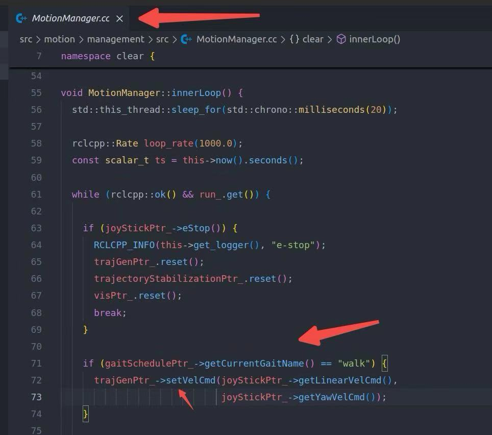

# Model Predictive Control for Bipedal Robot TRON 1 in MuJoCo Simulator


This work is focused on the study of convex MPC for bipedal robots.
Convex MPC not only works on the quadruped robots but also point foot bipedal robots.

# Build Package
## Install ROS2 according to your operating system
Refer to [ROS2](https://ros.org/) official doc.

## Dependency
```bash
sudo apt-get install ros-<ros2-distro>-eigenpy
sudo apt-get install ros-<ros2-distro>-pinocchio
```

## Build
```bash
git clone https://github.com/81578823/Bipedal_MPC.git
```

```bash
cd Bipedal_MPC & bash build.sh
echo "source Bipedal_MPC/install/setup.bash" >> ~/.bashrc
```

# Run Package
## Run Simulation
```bash
ros2 launch sim sim_launch.py 
```

## Run Controller
```bash
ros2 launch management management_launch.py 
```

# Change Velocity
if don't have the remote controller, you can change the linear velocity and angular velocity on this code file:


Then you can change the velocities on the JoyStick::getLinearVelCmd() and JoyStick::getYawVelCmd() (default: 0.4 (linear); 0.0 (angular))

# Future work
Nowadays, more and more people are used to using python. 
Hence, we will focus on converting the C++ work into a respository in python. So please waiting ...


